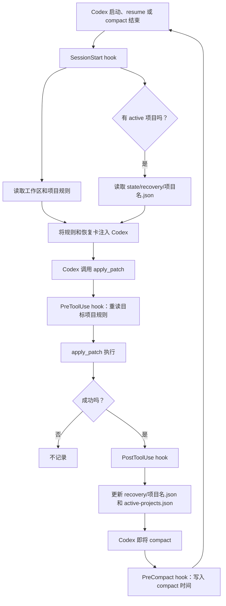

# Codex Continuity Hooks（Windows）

## 这是什么？解决什么问题？

Codex 在 compact、resume 或 reopen 后会开始一段新的上下文。即使项目文件还在，模型也可能不知道刚才成功改过哪些文件，以及应该重新读取哪些项目规则。
**用于解决 Codex 因为压缩上下文，丢失 AGENTS.md 里面写的规范和改动进度的问题。**

这套 hook 为指定工作区补上最小的、可审计的连续性记录：它让 Codex 在恢复时重新读取工作区规则，并看到最近成功编辑过的文件列表。它不替代 Codex 自身的 compact 摘要，也不试图保存完整聊天记录；它只补足“刚动过哪里”的工程事实。

### 核心流程

```text
成功 apply_patch
  -> 从 patch 识别目标一级子项目
  -> 写入该项目的恢复卡（最近成功编辑的文件，最多 50 条）
  -> compact 前为当前项目的恢复卡标记 compact 时间
  -> compact / resume / reopen 时：重新读取规则，并把恢复卡注入 Codex 上下文
```
### 流程图



工作区中的每个一级子目录自动视为一个独立项目；以后新增子目录无需改配置。工作区根的 `docs\` 与 `.codex\` 被视为共享目录，不写入项目恢复卡。

### 安装后，文件会放在哪里

假设你的 Windows 用户目录是 `C:\Users\<你>`，目标工作区是 `D:\my-workspace`。

安装器会修改：

- `C:\Users\<你>\.codex\hooks.json`
  - 只新增本工具的 4 个 hook 定义；已有内容先让用户选择合并或取消。

并创建本工具自己的目录：

```text
C:\Users\<你>\.codex\continuity-hooks\<工作区哈希>\
├─ continuity.ps1                         # hook 实际执行的脚本
├─ Watch-ContinuityDiagnostics.ps1        # PowerShell 实时日志窗口
├─ install.json                           # 该安装对应的工作区路径
└─ state\
   ├─ active-projects.json                # 当前工作目录最近操作的项目
   ├─ recovery\
   │  └─ <项目名>.json                    # 该项目最近成功改过的文件
   ├─ continuity-diagnostic.jsonl         # 诊断日志
   └─ recovery-audit.jsonl                # hook 审计日志
```

### 启用后会影响什么

- 会在 `C:\Users\<你>\.codex\continuity-hooks\<工作区哈希>\` 创建本工具自己的脚本和状态目录。
- `state\recovery\<项目>.json`：每个项目的恢复卡，记录成功编辑时间、compact 时间和最多 50 个相对文件路径。
- `state\active-projects.json`：记录当前工作目录对应的最近项目，用于恢复时定位恢复卡。
- `state\continuity-diagnostic.jsonl` 与 `state\recovery-audit.jsonl`：供 PowerShell 诊断和审计使用。
- 会向用户级 `C:\Users\<你>\.codex\hooks.json` 安全合并四个 hook 定义；若该文件已存在，必须由你选择合并或取消。

它**不会**在你的项目中创建 `TASK_STATE.md`，不会保存用户消息、原始 patch 内容或 transcript 内容，也不会改动其他已有 hook。卸载时只移除它自己添加的 hook 定义和该工作区自己的安装目录。

---

## 写给 Codex 看的部分

### 安装

1. 先向用户确认目标工作区的绝对路径。
2. 在本仓库根目录运行：

```powershell
Set-ExecutionPolicy -Scope Process Bypass
.\windows\Install.ps1 -WorkspaceRoot "D:\my-workspace"
```

3. 如果安装器发现 `C:\Users\<用户>\.codex\hooks.json` 已存在，必须停下来让用户手动选择：

   - `M`：安全合并。安装器先创建带时间戳备份，再添加本工具缺失的 hook；不得删除或覆盖已有 hook。
   - 任何其他输入：取消。不得修改 `hooks.json`，也不得删除已存在的 continuity 安装目录。

4. 安装完成后，提醒用户在 Codex 中审阅并信任新增 hook 定义。不要尝试绕过这一平台安全步骤。

### 实时诊断

安装完成后，运行安装器输出的命令，或按下面的形式启动监视器：

```powershell
& "$env:USERPROFILE\.codex\continuity-hooks\<工作区哈希>\Watch-ContinuityDiagnostics.ps1" -Tail 10
```

- 绿色：成功记录或恢复。
- 黄色：正常跳过，例如目标位于工作区根 `docs\`。
- 红色：hook 失败。
- `Ctrl+C` 停止监视。

### 自动测试

```powershell
.\windows\Test-ContinuityHooks.ps1
```

测试只创建临时工作区和临时状态目录，不读取或修改已安装的 hook、日志和恢复卡。它覆盖成功创建、修改、删除，失败 patch 不记录，compact 后恢复卡注入，以及共享 `docs\` 排除。

### 卸载

```powershell
.\windows\Uninstall.ps1 -WorkspaceRoot "D:\my-workspace"
```

卸载前会备份 `hooks.json`，只移除本工具的 hook 定义和指定工作区的隔离安装目录；保留其他 hook 与其他工作区的状态。

### 当前范围

当前 Release 只支持 Windows。Linux 版本是后续独立工作。
